# Capture the Flag

In this example, the option to authenticate and sign/encrypt between the OPC UA Server and the OPC UA Client is considered. For the purposes of this training, imagine that you, as an attacker, have access to a local OPC UA Client and want to use it to log on to a OPC UA Server to gain write access. If successful, you will receive the flag and the training is completed.

## Client
UaExpert is a full-featured OPC UA Client which is capable of several OPC UA and features. You need to register and download a client from the following link:   
https://www.unified-automation.com/downloads/opc-ua-clients.html   
Double click on the AppImage to start the OPC UA Client. If you start the program for the first time, you may be asked to create a new *Application Instance Certificate*. Leave the default settings and add *THA Augsburg* as required *Organization* value.

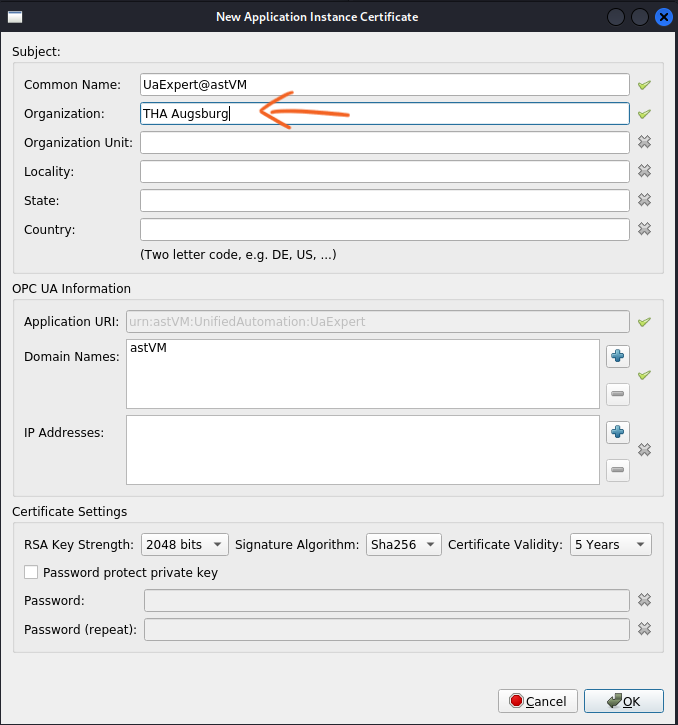

## Brute forcing password

One way to log in to the OPC UA Server from the OPC UA Client is to use a username and a password. The objective of this part of the training is to reveal a valid username with the corresponding password. To do this, try to crack a user's authentication password using a brute force attack. Use the Metasploit module for OPC UA:   
https://github.com/COMSYS/msf-opcua/tree/master

To set up of the scanner module, follow the *Instructions* in the README.md of the link. It's necessary to install the opcua-module via pip: `pip3 install opcua`. Metasploit is installed in Kali by default. Add the `modules` directory found in this repository to the `modules` directory of Metasploit. This is located under the path `~/.msf4/modules`.   

Then use *opcua_hello* to verify that an OPC UA Server is running on an open port by following step 2 of the *Typical Workflow* described.   
If this is successful, follow step 4 and use *opcua_login* to brute force credentials for OPC UA Server instances. As input credential the input file, *credentials.txt* located in this folder should be used.   
(hints: IP 10.0.0.1, PORT 4840, FILE /root/CybICS/training/opcua/credentials.txt)

In the case of a successful brute force attack, you should see the username and password labeled *success* as output. This procedure can also be traced in Wireshark (see *Wireshark capture* training) and the usernames and passwords used in the attack can be read out in plain. 

  
Solution

  Username: user1
  Passwort: test

  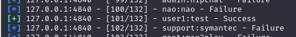

  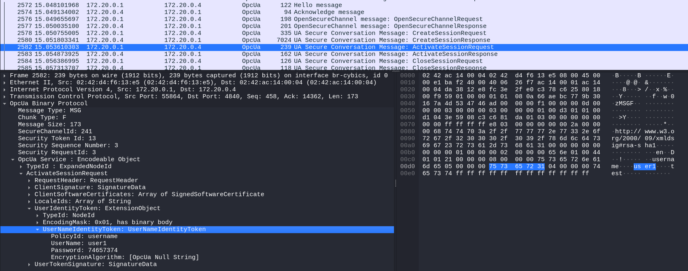

Now log in to the OPC UA Server. To do so, open the UA Expert and add a new server by pressing the *blue cross* button. Choose in the in the pop-up window the security mode *None*, choose the authentication method *username/password* and press ok. It's possible to change both security mode and authentication method. This will be done later on.

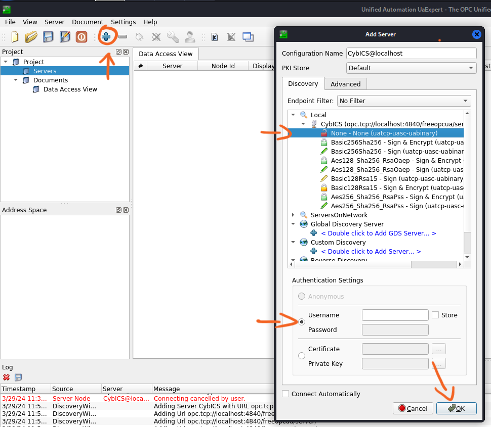

Connect to the server by pressing the *powerplug* button. Enter in the pop-up window the cracked credentials.

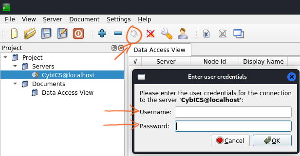

When connecting first time with the server, a pop-up regarding certificate validation may occur. Press the button *Trust Server Certificate* and continue.
As the security mode *None* was selected when the server was added, a warning regarding insecure communication via plain text appears. Ignore this by pressing the *ignore* button.

Now select a variable from the *Address Space* on the left side. Choose e.g. *Set > 0 to obtain flag!* under the domain *CybICS Variables* and drag it via drag and drop in the sub-window *Data Access View*. Try to change the value.

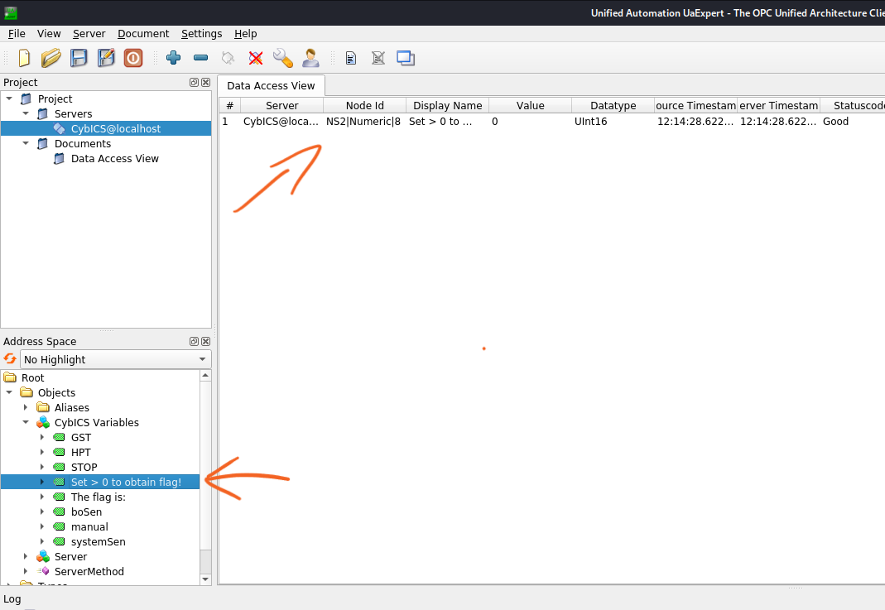

You will recognize that this is not possible due to a lack of access rights. The permissions you received with this authentication are read-only.

## Certificate handling

Another option to authenticate on the server is certificate based. For this you need a valid x.509 certificate with the corresponding private key. You will find these files in the repository folder */training/opcua/*.
The objective of this part of the training is to write a value to a specific variable of the OPC UA Server. This will cause the value of another variable to change, from which the flag can then be taken.

To achieve the scenario described, you need to disconnect from the server by pressing the *crossed out powerplug* button.

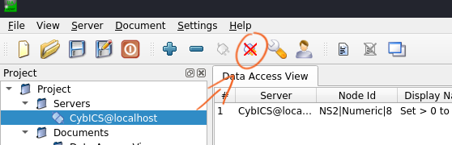

Edit the connection settings by pressing the button with the *wrench*. Change in the pop-up window the *Authentication Settings* to *Certificate* and *Private Key*. Select the certificate and private key for the OPC UA Client from the folder. Press *ok* and connect to the server.

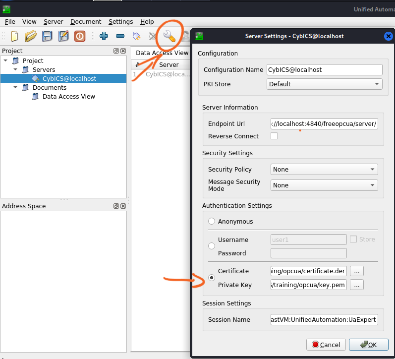

Now observe the variables *"Set >0 to obtain flag!"* and *"The flag is:"*. Try to write a value of the *"Set >0 to obtain flag!"*. If successful, you will see a value for the variable *"The flag is:"*. This is the flag you were looking for. 

  
Solution

  
  Flag: CTF_2024_OPCUA

  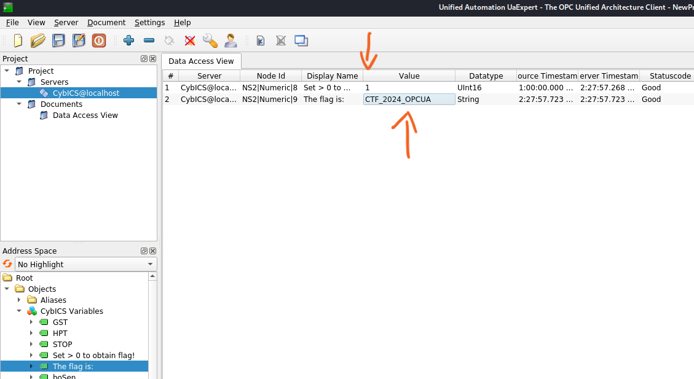

The training has been successfully completed! You have gained write access to the OPC UA Server using the stolen identity.

## Securtiy Settings

For additional information, monitor the network traffic between the client and the server using Wireshark with different *Security Settings*. To do this, disconnect from the server, change the *Security Settings* in the *Server Settings* pop-up window, and reconnect to the server. 

You will see that the *sign* and *sign and encrypt* options create a secure channel. When the connection is encrypted, it's impossible to read any plain text or data from the captured network traffic.  

  
Solution

  
  Sign: e.g. CTF_2024_OPCUA readable in plain

  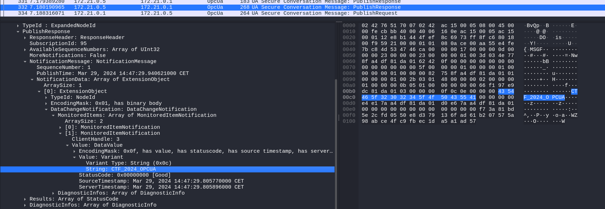
  
  Sign and encrypt: No content readable

  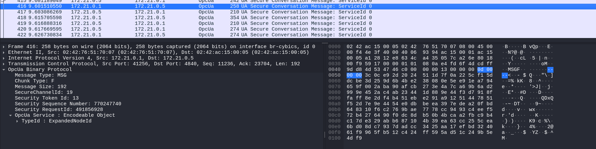

